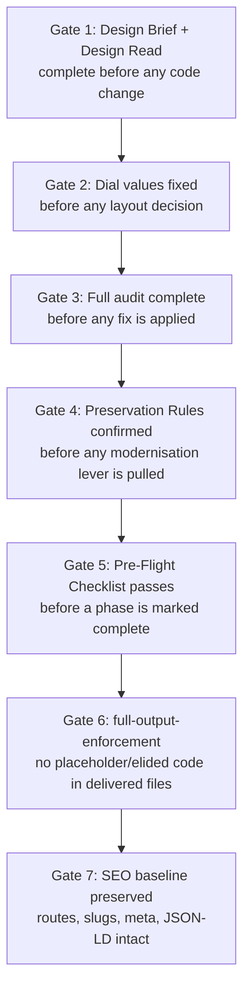
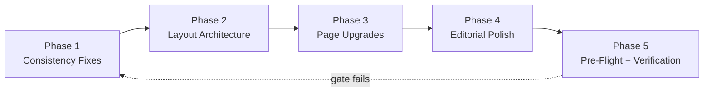
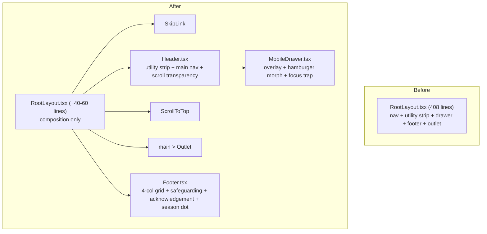
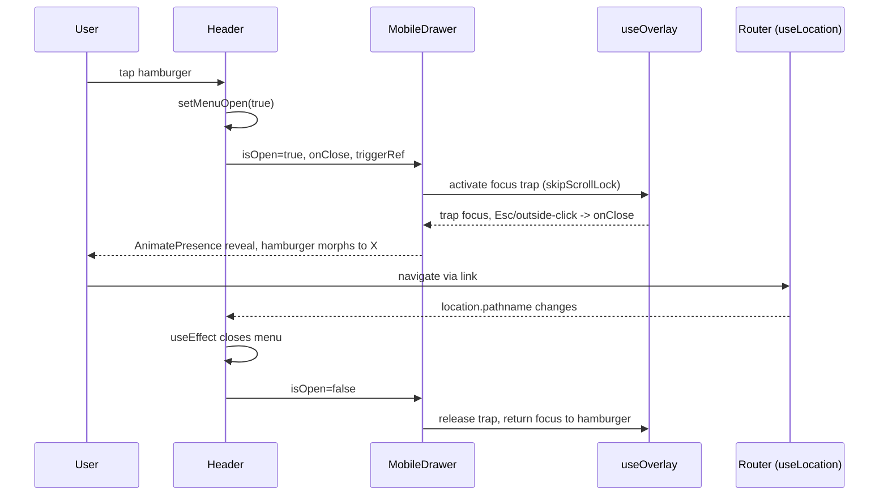

# Design Document: Parish Website Design Revamp

## Overview

This is a **design-quality upgrade in "Preserve" mode** for the Greenacres Walkerville Catholic Parish website — an existing React 18 + TypeScript SPA (Vite, Tailwind CSS, Framer Motion). The codebase is already in good shape (zero hardcoded hex in `.tsx`, full dark mode, established `parish-*` token system, a working `PageTemplates` system, and strong accessibility fundamentals). The goal is to lift overall design quality using the approved taste-skill stack **without rewriting** the system or eroding its "Sacred Editorial" identity.

The work is organised into five sequential phases that move from low-risk consistency fixes, through structural refactor (decomposing the 408-line `RootLayout` monolith), into per-page quality upgrades and editorial polish, and finally a verification gate. Every phase is bounded by **Preservation Rules** and **Hard Gates** that prevent the revamp from drifting into a redesign.

This design captures both the high-level architecture (component decomposition, data flow, token/shadow system) and the low-level detail (function signatures, algorithms, formal specifications, correctness properties) needed to implement the change safely. It also surfaces six **open decisions** that require user resolution before the corresponding implementation work begins.

---

## Skill Activation Protocol

These skills MUST be active before any design or code work. They are the source of the quality bar this revamp is held to.

| Skill | Role in this revamp |
| --- | --- |
| `redesign-existing-projects` | Primary lens. Enforces "audit before modernise", preservation of existing identity, and upgrade-not-rewrite discipline. |
| `design-taste-frontend` (v2) | Defines the taste rubric (typography, spacing, motion, layout variance, interaction states). Section 4.11 is directly relevant to the inverse-section conflict (Decision 1). |
| `full-output-enforcement` | Guards against placeholder/elided output. All generated component code must be complete and runnable — no `// ... rest unchanged` stubs in delivered files. |

Project quality gates from `AGENTS.md` also apply at merge time: `gstack-design-quality`, `gstack-code-review` (and `gstack-security-audit` only if auth/data surfaces change — this revamp does not intend to).

## Design Brief Dials

These dials calibrate the taste skill for a faith-community audience. They are deliberately mid-to-high, not maximal — reverence and readability outrank spectacle.

| Dial | Value | Rationale |
| --- | --- | --- |
| `DESIGN_VARIANCE` | **4–5** | Editorial variety and asymmetry are welcome, but the parish identity is calm and consistent. Avoid variance so high it fragments the Sacred Editorial system. |
| `MOTION_INTENSITY` | **3–4** | Framer Motion reveals and hover lifts are on-brand; respect `prefers-reduced-motion` always. No attention-grabbing or looping motion. |
| `VISUAL_DENSITY` | **5–6** | Content-rich parish pages (mass times, readings, news) need moderate-to-high density without clutter. |

## Hard Gates (Non-Negotiable Sequencing)

These gates are ordered. A later gate may not begin until the earlier one is satisfied.



1. **Design Brief + Design Read before code changes** — dials set and existing design system read/understood first.
2. **Dial values before layout decisions** — no layout call is made without referencing `DESIGN_VARIANCE`, `MOTION_INTENSITY`, `VISUAL_DENSITY`.
3. **Full audit before fixes** — the complete issue inventory exists before the first edit (already captured in Current State Assessment).
4. **Preservation Rules before modernisation levers** — confirm what must not change before changing anything.
5. **Pre-Flight Checklist before phase completion** — the 62-item checklist plus automated verification gate each phase.
6. **`full-output-enforcement` patterns absent** — delivered files contain no placeholder stubs.
7. **SEO baseline preserved** — routes, slugs, `usePageSEO` metadata, and `JsonLdSchema` output unchanged unless a change is explicitly requested.

---

## Preservation Rules (Must Not Change)

These are invariants. Every phase is verified against them.

- **Design tokens:** all `parish-*` tokens (`parish-bg`, `parish-surface`, `parish-elevated`, `parish-fg`, `parish-muted`, `parish-accent`, `parish-secondary`, `parish-brass`, `parish-border`, `parish-inverse`, shell/overlay surfaces). No new hardcoded hex in `.tsx`. Documented exceptions only: `text-white` on image overlays, Facebook brand `#1877F2`.
- **Dark mode ("Sacred Night"):** `data-theme="dark"` strategy, `ThemeContext`, `localStorage` persistence. Every change must work in both themes.
- **Type pairing:** Merriweather (`font-display`) + Outfit (`font-body`). No new font families.
- **Liturgical season colour system:** `useLiturgicalSeason`, `liturgicalColour.ts`, season dot in footer.
- **Component vocabulary:** the "sanctuary / pilgrimage / scripture" CSS class language (`sanctuary-panel`, `sanctuary-card`, `pilgrimage-button*`, `scripture-panel`, `ornamental-kicker`, `section-label`). Class names are part of the identity — extend, don't rename.
- **PageTemplates system:** `StoryPageTemplate`, `UtilityPageTemplate`, `HighlightPageTemplate`, `SectionIntro`, `InfoCard`, `ScriptureBlock`, `ActionBand`.
- **ContentStates:** `ContentLoading`, `ContentError`, `ContentEmpty` are the canonical state components.
- **Accessibility wins:** 18px base font, 44px minimum touch targets, `focus-visible` brass ring (3px `hsl(var(--color-parish-brass))`), `prefers-reduced-motion` honoured.
- **SEO:** routes/slugs in `routes.ts`, `usePageSEO`, `JsonLdSchema`, `sitemap.xml`.

---

## Current State Assessment (Audit Result — Gate 3)

Per-page quality scores (baseline → target where applicable):

| Page / Module | Score | Target |
| --- | --- | --- |
| `DailyReadingsPage` | 5/5 (gold standard) | preserve, light editorial polish |
| `GalleryPage` | 4.5/5 | preserve |
| `MassTimesPage` | 4.5/5 | preserve |
| `NotFoundPage` | 4.5/5 | preserve |
| `HomePage` | 4/5 | refine sections |
| `ContactPage` | 4/5 | map polish |
| `NewHerePage` | 4/5 | preserve |
| `NewsEventsPage` | 4/5 | preserve |
| `VolunteerPage` | 4/5 | focus-ring fix |
| `AboutPage` | 3.5/5 | **4.5** |
| `HistoryPage` | 3.5/5 | **4.5** |
| `BulletinPage` | 3.5/5 | **4.5** |
| `RootLayout` | 4/5 (408-line monolith) | decompose to ~40–60 lines |

Six concrete issues found in the audit:

1. **Loading/error inconsistency** — `AboutPage`, `HistoryPage`, `BulletinPage` use ad-hoc `Loading…` divs instead of `ContentLoading`/`ContentError`.
2. **`RootLayout` monolith** — 408 lines mixing header, drawer, footer concerns.
3. **Non-functional search button** — a `Search` icon button in the header bar with no behaviour (Decision 2).
4. **`VolunteerPage` focus conflict** — form inputs use `focus:outline-none`, suppressing the brass focus-visible ring.
5. **Icon accessibility inconsistency** — decorative vs meaningful icons not consistently marked (`aria-hidden` vs `aria-label`).
6. **Spacing micro-inconsistency** — mixed section rhythm (`mt-12 md:mt-16` vs `mt-16 md:mt-20`).

---

## Architecture

### Phase flow (high-level)



### Layout decomposition (Phase 2 — the structural heart of the revamp)

`RootLayout.tsx` currently owns three distinct concerns. The target is composition-only.



Shared state and config that the new components consume:

- `useLiturgicalSeason()` → Footer season dot.
- `useOverlay({ isOpen, onClose, triggerRef, skipScrollLock })` → MobileDrawer focus trap.
- `useScroll()` + `useMotionValueEvent` → Header scroll-aware transparency.
- `PRIMARY_NAV`, `DRAWER_GROUPS`, `QUICK_ACTIONS`, `FOOTER_QUICK_LINKS`, `isActive` from `lib/navigation.ts` (unchanged).
- `AccessibilityMenu`, `ThemeToggle` (unchanged).

### Component interaction during drawer open (sequence)



---

## Components and Interfaces

### Component 1: `RootLayout` (refactored, composition-only)

**Purpose:** Compose the shell. No presentational markup beyond structural wrappers.

**Interface:**
```typescript
export function RootLayout(): JSX.Element;
// Renders: SkipLink, Header, ScrollToTop, <main id="main-content"><Outlet/></main>, Footer
```

**Responsibilities:**
- Own no header/drawer/footer markup directly.
- Provide the `flex min-h-screen flex-col` shell and the `<main id="main-content">` landmark.
- Delegate all navigation behaviour to `Header` (which owns `MobileDrawer`).

### Component 2: `Header`

**Purpose:** Utility strip + main nav bar with scroll-aware transparency; hosts `AccessibilityMenu`, `ThemeToggle`, and the search-button decision (Decision 2).

**Interface:**
```typescript
export function Header(): JSX.Element;

// Internal state
interface HeaderState {
  menuOpen: boolean;       // controls MobileDrawer
  isScrolled: boolean;     // scrollY > 40
}
```

**Responsibilities:**
- Preserve `role="navigation"` + `aria-label="Main navigation"`.
- Preserve green shell styling (`bg-parish-shell-bg text-parish-shell-fg`) on the utility strip.
- Preserve scroll detection (transparent over hero on home when not scrolled).
- Own `menuOpen` and the `hamburgerRef` trigger; render `MobileDrawer`.
- Render desktop `PRIMARY_NAV` with `isActive` highlighting.

### Component 3: `MobileDrawer`

**Purpose:** Full-screen mobile menu overlay.

**Interface:**
```typescript
interface MobileDrawerProps {
  isOpen: boolean;
  onClose: () => void;
  triggerRef: React.RefObject<HTMLButtonElement>;
}
export function MobileDrawer(props: MobileDrawerProps): JSX.Element;
```

**Responsibilities:**
- `AnimatePresence` reveal; preserve the hamburger→X morph (lives in Header trigger; drawer animates content).
- `useOverlay` focus trap with `skipScrollLock: true`, `role="dialog"`, `aria-modal="true"`, `id="mobile-drawer"`.
- Render `DRAWER_GROUPS` (grouped nav) and `QUICK_ACTIONS` panel.
- Mobile `AccessibilityMenu` + `ThemeToggle`.

### Component 4: `Footer`

**Purpose:** 4-column footer with parish-critical statutory content.

**Interface:**
```typescript
export function Footer(): JSX.Element;
```

**Responsibilities:**
- 4-column grid: identity, quick links, parish office, acknowledgement.
- **Preserve child safeguarding contacts** (Child Abuse Report Line, Archdiocese Office) — statutory, must not be dropped.
- **Preserve Aboriginal/Torres Strait (Kaurna) acknowledgement** — must not be dropped.
- Liturgical season dot via `useLiturgicalSeason()`.
- Social links with `aria-label`.

### Component 5: `PageTemplates` (refined, not restructured)

**Purpose:** Section typography refinement only. The template API is preserved.

**Interface (unchanged signatures):**
```typescript
export function StoryPageTemplate(props: BaseTemplateProps): JSX.Element;
export function UtilityPageTemplate(props: BaseTemplateProps): JSX.Element;
export function HighlightPageTemplate(props: BaseTemplateProps): JSX.Element;
export function SectionIntro(props: SectionIntroProps): JSX.Element;
export function InfoCard(props: SurfaceProps): JSX.Element;
export function ScriptureBlock(props: SurfaceProps): JSX.Element;
export function ActionBand(props: SurfaceProps): JSX.Element;
```

**Responsibilities:**
- Refine section heading rhythm and the `mt-16 md:mt-24` body spacing into a single consistent scale (resolves issue 6).
- No prop signature changes — pages must not need edits to consume refined templates.

### Component 6: `ContentStates` (consumption standardised, component unchanged)

**Interface (existing):**
```typescript
export function ContentLoading(props: { message?: string }): JSX.Element;
export function ContentError(props: { title?: string; message?: string }): JSX.Element;
export function ContentEmpty(props: { message?: string }): JSX.Element;
```

**Responsibilities:** become the single loading/error pattern across all data-driven pages (resolves issue 1).

---

## Data Models

This is a presentation-layer revamp; no new persisted data models. The models below describe internal config/derived shapes the design relies on.

### Model 1: Section spacing scale (resolves issue 6)

```typescript
/** Canonical vertical rhythm between page sections. */
type SectionGap = 'mt-16 md:mt-24';   // chosen single scale for between-section spacing
type SubSectionGap = 'mt-12 md:mt-16'; // reserved for within-section grouping only
```

**Validation rules:**
- A top-level `<section>` following the hero uses `SectionGap`.
- `SubSectionGap` is only used inside a section, never between sections.
- No bare `mt-20`/`mt-16` mixed usage between sibling sections.

### Model 2: Warm-tinted shadow tokens (Phase 2, `index.css`)

```css
/* Defined under :root and inherited by html[data-theme="dark"]. */
/* References --parish-fg so the tint auto-adapts between themes. */
:root {
  --parish-shadow-color: var(--color-parish-fg);      /* warm near-black light / warm bone dark */
  --shadow-sm:  0 1px 3px   rgb(var(--parish-shadow-color) / 0.06);
  --shadow-md:  0 8px 24px -8px rgb(var(--parish-shadow-color) / 0.10);
  --shadow-lg:  0 16px 48px -12px rgb(var(--parish-shadow-color) / 0.14);
}
```

**Validation rules:**
- Shadows reference `--parish-fg`, never literal `rgba(0,0,0,…)` (the current `sanctuary-panel`/`sanctuary-card` hardcoded blacks are migrated to these tokens).
- Dark mode requires no separate shadow declarations — the tint follows the foreground token.
- Existing visual weight is preserved (opacities tuned to match current appearance).

### Model 3: Icon accessibility classification (resolves issue 5)

```typescript
/** Every lucide icon must be classified at the call site. */
type IconRole =
  | { kind: 'decorative' }                 // -> aria-hidden="true"
  | { kind: 'meaningful'; label: string }; // -> aria-label on icon OR accessible name on parent control
```

**Validation rules:**
- Icon inside a control that already has a text label or `aria-label` → `aria-hidden="true"`.
- Icon that is the sole content of a control → the control needs an accessible name (`aria-label`).
- No icon is left unclassified.

### Model 4: Reflection content shape (Phase 4, drop-cap scope — Decision 6)

```typescript
/** Distinguishes parish-authored prose (drop-cap eligible)
 *  from liturgical scripture text (NOT drop-cap eligible). */
interface ReflectionContent {
  priestReflection: string;        // parish-authored -> ::first-letter drop cap allowed
  liturgicalReadingText?: string;  // Jerusalem Bible -> NEVER drop-capped (reverence + licensing)
}
```

---

## Phased Design Detail

### Phase 1 — Consistency Fixes (low risk, no structural change)

| Issue | Fix | Files |
| --- | --- | --- |
| Loading/error inconsistency | Replace ad-hoc `Loading…` divs with `ContentLoading` (loading) and `ContentError` (no content), matching `ContactPage`'s pattern. | `AboutPage.tsx`, `HistoryPage.tsx`, `BulletinPage.tsx` |
| Icon a11y inconsistency | Apply `IconRole` classification across nav, footer, cards. | layout + page icons |
| VolunteerPage focus ring | Remove `focus:outline-none`; rely on global `focus-visible` brass ring (or pair with `focus-visible:outline-none focus-visible:ring`). | `VolunteerPage.tsx` |
| Non-functional search | **Decision 2** — remove (recommended) or implement basic search. | `Header.tsx` |
| Spacing micro-fix | Apply `SectionGap` scale. | affected pages / `PageTemplates` |

**Canonical loading/error pattern:**
```typescript
const { content, isLoading } = useParishData();
if (isLoading) return <ContentLoading />;
if (!content) return <ContentError />;
```

### Phase 2 — Layout Architecture

Extract `Header.tsx`, `MobileDrawer.tsx`, `Footer.tsx` from `RootLayout.tsx`; reduce `RootLayout` to composition-only. Add warm-tinted shadow system to `index.css` and migrate `sanctuary-panel`/`sanctuary-card`/`pilgrimage-button` shadows onto the tokens. Refine section typography in `PageTemplates`.

**Behaviour parity is the acceptance bar:** scroll transparency, drawer focus trap, route-change auto-close, ARIA attributes, and animation timing must be byte-for-byte equivalent in behaviour after extraction.

### Phase 3 — Page Upgrades (3.5 → 4.5)

- **AboutPage:** standardise states; strengthen leadership/council layout; resolve council photo treatment (Decision 4); apply variance dial to section rhythm.
- **HistoryPage:** standardise states; timeline interaction (Decision 5); editorial typography.
- **BulletinPage:** standardise states; reflection typography (respecting Decision 6 scope).

### Phase 4 — Editorial Polish

- **DailyReadingsPage:** `::first-letter` drop cap on **reflection text only** (Decision 6), `hanging-punctuation: first`, `tabular-nums` verse numbers, `text-wrap: pretty`.
- **Home:** `EventsList` featured-card asymmetry; `TaskCards` hover lift `-translate-y-0.5`; interactive enhancement pass.
- **ContactPage:** loading state for Google Maps iframes, rounded container with parish shadow tokens, descriptive iframe `title`s (already present — verify/upgrade).

### Phase 5 — Pre-Flight & Verification

62-item checklist + automated gate, then manual review. See Testing Strategy.

---

## Low-Level Design

### Function: `RootLayout()` (after refactor)

```typescript
function RootLayout(): JSX.Element
```

**Preconditions:**
- `Header`, `MobileDrawer`, `Footer`, `SkipLink`, `ScrollToTop` exist and export as specified.
- Router context is present (rendered inside `<RouterProvider>`/route element).

**Postconditions:**
- Renders exactly one `<main id="main-content">` landmark containing `<Outlet/>`.
- Renders exactly one navigation landmark (inside `Header`) and one `contentinfo` landmark (inside `Footer`).
- Contains no header/drawer/footer presentational markup itself.
- Total line count ≤ 60.

**Loop invariants:** N/A (no loops).

### Function: `Header()` scroll transparency

```typescript
function useHeaderScroll(): { isScrolled: boolean }
```

**Preconditions:** runs within Framer Motion scroll context (`useScroll` available).

**Postconditions:**
- `isScrolled === (scrollY > 40)` at all times after a scroll event settles.
- On the home route while `!isScrolled`, the nav bar renders transparent; otherwise it renders the blurred surface background.
- Behaviour identical to pre-refactor `RootLayout`.

**Loop invariants:** N/A.

### Function: `MobileDrawer` open/close lifecycle

```typescript
function MobileDrawer(props: MobileDrawerProps): JSX.Element
```

**Preconditions:**
- `triggerRef` points to the mounted hamburger button.
- `onClose` is stable (memoised) to keep `useOverlay` effect deps stable.

**Postconditions:**
- When `isOpen` is true: focus is trapped within the drawer; `Esc` and outside-click invoke `onClose`; `aria-modal="true"` and `role="dialog"` are present.
- When `isOpen` transitions to false: focus returns to `triggerRef`; the overlay unmounts after exit animation.
- Route change closes the drawer (owned by `Header` effect on `location.pathname`).

**Loop invariants:**
- During the focus-trap tab cycle, focus always remains on an element that is a descendant of the drawer overlay.

### Algorithmic Pseudocode — Icon Accessibility Audit (issue 5)

```pascal
ALGORITHM auditIconAccessibility(iconUsages)
INPUT: iconUsages — list of icon call sites (icon, parentControl, hasAdjacentText)
OUTPUT: list of required edits

BEGIN
  edits ← empty list
  FOR each usage IN iconUsages DO
    parentHasName ← usage.parentControl.hasAriaLabel
                    OR usage.parentControl.hasTextChild
                    OR usage.hasAdjacentText

    IF usage.isPurelyVisual AND parentHasName THEN
      // decorative inside a named control
      IF NOT usage.icon.hasAriaHidden THEN
        edits.add(setAttribute(usage.icon, "aria-hidden", "true"))
      END IF
    ELSE IF usage.isSoleContentOfControl THEN
      // icon must carry the accessible name
      IF NOT (usage.parentControl.hasAriaLabel OR usage.icon.hasAriaLabel) THEN
        edits.add(addAccessibleName(usage.parentControl))
      END IF
    END IF
  END FOR
  RETURN edits
END
```

**Preconditions:** `iconUsages` enumerates every lucide icon render site in scope.
**Postconditions:** every icon is either `aria-hidden` (decorative) or has an accessible name path (meaningful); none unclassified.
**Loop invariants:** all previously visited usages are fully classified.

### Algorithmic Pseudocode — Shadow Token Migration (Phase 2)

```pascal
ALGORITHM migrateShadows(cssRules)
INPUT: cssRules — component rules with literal rgba black shadows
OUTPUT: updated rules referencing warm-tint tokens

BEGIN
  ASSERT tokensDefined("--parish-shadow-color", "--shadow-sm", "--shadow-md", "--shadow-lg")
  FOR each rule IN cssRules WHERE rule.usesLiteralBlackShadow DO
    tier ← classifyShadowTier(rule.boxShadow)   // sm | md | lg
    rule.boxShadow ← tokenFor(tier)
    ASSERT visualWeightUnchanged(rule)          // verified by review/screenshot diff
  END FOR
  ASSERT noSeparateDarkModeShadowRulesRequired()
  RETURN cssRules
END
```

**Preconditions:** warm-tint tokens are declared before any rule references them.
**Postconditions:** no component box-shadow uses literal `rgba(0,0,0,…)`; dark mode needs no extra shadow rules; perceived elevation is preserved.
**Loop invariants:** every processed rule references a token and preserves its tier.

### Function: Scripture drop cap (Phase 4, Decision 6)

```typescript
/** Applies an editorial drop cap to parish-authored reflection prose ONLY. */
function ReflectionProse(props: { text: string }): JSX.Element;
```

```css
/* Scoped class — applied to reflection prose, never to liturgical reading text. */
.reflection-prose {
  hanging-punctuation: first;
  text-wrap: pretty;
}
.reflection-prose > p:first-of-type::first-letter {
  font-family: var(--font-display);
  font-size: 3.2em;
  line-height: 0.8;
  float: left;
  padding-right: 0.08em;
  color: rgb(var(--color-parish-accent));
}
.verse-number { font-variant-numeric: tabular-nums; }
```

**Preconditions:** `text` is parish-authored reflection content (not Jerusalem Bible liturgical text).
**Postconditions:** only the first paragraph's first letter is decorated; liturgical reading blocks are unaffected; drop cap uses `parish-accent` and `font-display`.

---

## Example Usage

```typescript
// RootLayout after extraction — composition only
import { Header } from '../components/layout/Header';
import { Footer } from '../components/layout/Footer';
import { SkipLink } from '../components/SkipLink';
import { ScrollToTop } from '../components/ScrollToTop';
import { Outlet } from 'react-router-dom';

export function RootLayout() {
  return (
    <div className="flex min-h-screen flex-col">
      <SkipLink />
      <Header />
      <ScrollToTop />
      <main id="main-content" className="flex-1" role="main">
        <Outlet />
      </main>
      <Footer />
    </div>
  );
}
```

```typescript
// Standardised page state handling (AboutPage / HistoryPage / BulletinPage)
import { ContentLoading, ContentError } from '../components/ContentStates';

const { content, isLoading } = useParishData();
if (isLoading) return <ContentLoading />;
if (!content) return <ContentError />;
// ... render StoryPageTemplate as before
```

```typescript
// Header owns drawer open state and trigger; drawer is a child
const [menuOpen, setMenuOpen] = useState(false);
const hamburgerRef = useRef<HTMLButtonElement>(null);
const closeDrawer = useCallback(() => setMenuOpen(false), []);
// ...
<MobileDrawer isOpen={menuOpen} onClose={closeDrawer} triggerRef={hamburgerRef} />
```

---

## Correctness Properties

These are universal statements the implementation must satisfy. They double as the acceptance rubric and the property-test targets.

### Property 1: Token purity
For all `.tsx` files, colour literals are a subset of the allowed exceptions (`text-white` overlays, `#1877F2`). `∀ file ∈ tsxFiles : hardcodedHex(file) ⊆ {allowedExceptions}`.

**Validates: Requirements 6.1**

### Property 2: Theme totality
For every changed component `c` and every theme `t ∈ {light, dark}`, `c` renders with resolved `parish-*` tokens and no missing-variable fallback. `∀ c, ∀ t : renders(c, t) ∧ usesTokens(c)`.

**Validates: Requirements 6.2**

### Property 3: Refactor behavioural equivalence
For the header/drawer/footer extraction, observable behaviour is unchanged. `∀ interaction i : behaviour(after, i) ≡ behaviour(before, i)` for scroll transparency, drawer trap, route-close, and ARIA.

**Validates: Requirements 2.1**

### Property 4: Layout shrink
`lineCount(RootLayout_after) ≤ 60 ∧ exists(Header) ∧ exists(MobileDrawer) ∧ exists(Footer)`.

**Validates: Requirements 2.2**

### Property 5: State standardisation
`∀ p ∈ {About, History, Bulletin} : usesContentLoading(p) ∧ usesContentError(p) ∧ ¬usesAdHocLoadingDiv(p)`.

**Validates: Requirements 1.1**

### Property 6: Icon classification totality
`∀ icon : isAriaHidden(icon) ⊕ hasAccessibleName(icon)` (exactly one holds).

**Validates: Requirements 1.2**

### Property 7: Focus visibility
`∀ focusable f : focusVisible(f) ⇒ showsBrassRing(f)` — no `focus:outline-none` suppresses the ring (VolunteerPage).

**Validates: Requirements 1.3**

### Property 8: Shadow tinting
`∀ rule : usesShadow(rule) ⇒ referencesToken(rule) ∧ ¬usesLiteralBlack(rule)`.

**Validates: Requirements 2.3**

### Property 9: Drop-cap scope
`∀ block b : hasDropCap(b) ⇒ isParishAuthoredReflection(b) ∧ ¬isLiturgicalText(b)`.

**Validates: Requirements 4.1**

### Property 10: Touch + base-size invariants
Base font remains 18px; `∀ control : minSize(control) ≥ 44px`.

**Validates: Requirements 6.3**

### Property 11: Reduced motion
`∀ animation a : prefersReducedMotion() ⇒ duration(a) ≈ 0`.

**Validates: Requirements 6.4**

### Property 12: SEO baseline
Route set, slugs, `usePageSEO` outputs, and `JsonLdSchema` payloads are unchanged by the revamp.

**Validates: Requirements 6.5**

---

## Error Handling

### Scenario 1: Parish content fails to load
**Condition:** `useParishData()` returns `content == null` after loading.
**Response:** render `ContentError` (retry button + parish office contact fallback).
**Recovery:** user retries via `reload()`; statutory contact info remains reachable.

### Scenario 2: Google Maps iframe slow/blocked (ContactPage)
**Condition:** iframe network latency or blocked third-party frame.
**Response:** show a loading state inside the rounded parish-shadow container; keep descriptive `title` for AT.
**Recovery:** map populates when available; text address remains visible regardless.

### Scenario 3: Refactor regression in drawer focus trap
**Condition:** post-extraction, focus escapes the drawer or does not return to trigger.
**Response:** caught by Pre-Flight checklist + keyboard nav test before phase completion.
**Recovery:** block phase completion (Gate 5) until parity restored.

### Scenario 4: Reduced-motion user
**Condition:** `prefers-reduced-motion: reduce`.
**Response:** motion durations collapse to ~0 via existing global rules and `useReducedMotion` template branches.
**Recovery:** N/A — content fully usable without motion.

---

## Testing Strategy

### Unit Testing Approach
- Vitest + Testing Library (jsdom), per `AGENTS.md`.
- New `Header`, `MobileDrawer`, `Footer` get focused tests: render landmarks/ARIA, drawer open/close, route-change close, focus return to trigger.
- `ContentStates` adoption: assert About/History/Bulletin render `ContentLoading` while loading and `ContentError` when content is null.
- Icon a11y: assert decorative icons carry `aria-hidden` and icon-only controls have accessible names.

### Property-Based Testing Approach
Targeted, where properties are cheaply checkable in a static/lint or DOM sense.
- **Property test library:** `fast-check` (matches the JS/TS ecosystem).
- Token purity (property 1) — scan generated/changed `.tsx` for disallowed hex over arbitrary file samples.
- Icon classification totality (property 6) — for arbitrary rendered control trees, exactly one of `aria-hidden` / accessible-name holds for each icon.
- Spacing scale (Model 1) — sibling sections never mix gap scales.

### Integration Testing Approach
- Playwright (Chromium). Verify scroll transparency on home, mobile drawer open/trap/close, footer statutory content present in both themes.
- **Note (pre-existing):** `tests/home.spec.ts` asserts copy `/Catholic Parish in Adelaide/i` that does not match current hero text; this failure predates the revamp and is out of scope unless the user asks to fix it.

### Pre-Flight Checklist (Phase 5, 62 items — categories)
1. **Preservation (tokens, dark mode, type, classes, templates, a11y, SEO)** — invariants intact.
2. **Per-phase behaviour parity** — especially the layout extraction.
3. **Correctness properties 1–12** — each explicitly verified.
4. **Automated gate:** `npm run lint` (exit 0, warnings ok), `npx tsc -b` (clean), `npm test` (pass), `npm run build` (succeeds). `npm run verify:release` runs the full chain.
5. **Manual review:** visual screenshot diff in light + dark for every touched page; keyboard-only walkthrough; `gstack-design-quality` + `gstack-code-review` pass.

---

## Open Decisions (Require User Resolution)

These block the corresponding implementation work and must be resolved with the user.

### Decision 1 — Inverse sections vs `design-taste-frontend` v2 §4.11
The codebase uses inverse sections (`bg-parish-fg text-parish-surface`) which conflict with taste rubric §4.11.
- **Option A (recommended):** Keep inverse sections, justify under the "Color Block Story" exception, and limit to 1–2 per page.
- **Option B:** Redesign inverse sections using `parish-elevated` shades instead.
- **Recommendation:** **Option A** — preserves the Sacred Editorial identity with a bounded exception.

### Decision 2 — Non-functional search button
- **Option A (recommended):** Remove the non-functional `Search` button from the header.
- **Option B:** Implement a basic page/site search.
- **Recommendation:** **Option A** — removing dead UI is honest and lower-risk; search can be a future feature.

### Decision 3 — Hero layout
- Keep the centered hero (`DESIGN_VARIANCE = 4`) vs explore subtle asymmetry.
- **No default recommendation** — depends on appetite for variance vs preservation.

### Decision 4 — Council member photos (AboutPage)
- `rounded-full` circles vs `rounded-2xl` squircle.
- **No default recommendation** — squircle aligns better with the existing card language; confirm with user.

### Decision 5 — Timeline interaction (HistoryPage)
- Hover lift only vs click-to-expand vs leave as-is.
- **No default recommendation** — scope/effort tradeoff.

### Decision 6 — Scripture drop caps (DailyReadingsPage / BulletinPage)
- Drop caps apply to **parish-authored reflection text only**, never Jerusalem Bible liturgical text (reverence + licensing).
- **This is a constraint, not a toggle** — implementation must honour it.

---

## Performance Considerations
- No new runtime dependencies introduced. Component extraction is a structural refactor with neutral bundle impact (possibly a small improvement via clearer code-splitting boundaries).
- Shadow tokens are CSS-variable lookups — negligible cost, and they remove duplicated dark-mode shadow rules.
- Framer Motion usage stays within current patterns; `MOTION_INTENSITY 3–4` discourages heavy/looping animation.

## Security Considerations
- Presentation-only revamp; no changes to Supabase access, auth, RLS, or data surfaces are intended. `gstack-security-audit` is therefore not gating unless an unexpected auth/data change is introduced.
- ContactPage map iframes: keep sandboxed/standard embed attributes and descriptive titles; no new third-party scripts.

## Dependencies
- Existing only: React 18, TypeScript, Vite, Tailwind CSS, Framer Motion, lucide-react, React Router, Vitest, Playwright. Node 22.
- No additions expected; if `fast-check` is adopted for property tests, it is a dev-only dependency pinned to an exact version.
