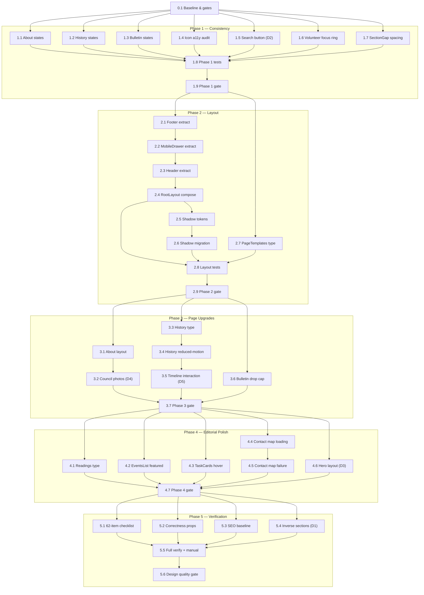

# Implementation Plan

## Overview

This plan implements the Parish Website Design Revamp in "Preserve" mode. Tasks are sequenced by the five phases and respect the seven Hard Gates from the design (a later gate cannot begin until the earlier gate is satisfied). Each phase ends with a verification task that runs the automated gate before the phase is considered complete. This is a refactor-and-polish effort, not a rewrite: every task preserves the `parish-*` tokens, dark mode, Merriweather/Outfit pairing, component vocabulary, PageTemplates, ContentStates, accessibility wins, and SEO baseline.

## Tasks

### Phase 0 — Baseline & Gate Setup

- [x] 0.1 Capture the pre-revamp baseline and confirm preservation invariants
  - Record current route set, slugs, `usePageSEO` outputs, and `JsonLdSchema` payloads as the baseline for byte-for-byte comparison in Phase 5
  - Run `npm run lint`, `npx tsc -b`, `npm test`, `npm run build` and record current pass/fail state (note the known pre-existing `tests/home.spec.ts` copy mismatch)
  - Confirm Design Brief dials (DESIGN_VARIANCE 4–5, MOTION_INTENSITY 3–4, VISUAL_DENSITY 5–6) and the Preservation Rules list are in effect for all subsequent work
  - _Requirements: 6.7, 5.4_

### Phase 1 — Consistency Fixes

- [x] 1.1 Standardise loading/error state on AboutPage
  - Replace the ad-hoc `Loading…` markup with the `ContentLoading` component while content is loading
  - Render `ContentError` when content resolves to null after loading completes
  - _Requirements: 1.1, 1.2_

- [x] 1.2 Standardise loading/error state on HistoryPage
  - Replace ad-hoc loading markup with `ContentLoading`; render `ContentError` on null content
  - _Requirements: 1.1, 1.2_

- [x] 1.3 Standardise loading/error state on BulletinPage
  - Replace ad-hoc loading markup with `ContentLoading`; render `ContentError` on null content (preserve the existing not-found state)
  - _Requirements: 1.1, 1.2_

- [x] 1.4 Audit and classify icon accessibility across the codebase
  - Walk every rendered lucide icon (nav, footer, cards, pages) and apply the `IconRole` classification from the design
  - Decorative icons inside a named control get `aria-hidden="true"` and no accessible name; icon-only controls get an accessible name on the icon or parent
  - Leave no icon unclassified
  - _Requirements: 1.3_

- [x] 1.5 Resolve the non-functional search button (Decision 2)
  - **Decision checkpoint:** confirm removal (recommended) vs implement basic page search
  - If removal: delete the `Search` button and the now-unused `Search` import from the header
  - If implement: add a working search overlay that returns matching results for a non-empty query and an empty-results indication when nothing matches
  - _Requirements: 1.6_

- [x] 1.6 Fix VolunteerPage focus-ring suppression
  - Remove `focus:outline-none` from form inputs so the global brass `focus-visible` ring shows
  - Preserve the custom focus border by pairing with `focus-visible:ring-parish-brass` (or `focus-visible:outline-none focus-visible:ring`)
  - _Requirements: 1.4, 1.5_

- [x] 1.7 Apply the SectionGap spacing scale on VolunteerPage and any mismatched pages
  - Replace `mt-12 md:mt-16` between top-level sections with the canonical `mt-16 md:mt-24` SectionGap; reserve SubSectionGap for within-section grouping only
  - _Requirements: 1.7_

- [x] 1.8 Add unit tests for the Phase 1 fixes
  - Assert About/History/Bulletin render `ContentLoading` while loading and `ContentError` when content is null
  - Assert decorative icons carry `aria-hidden` and icon-only controls have an accessible name
  - _Requirements: 1.1, 1.2, 1.3_

- [x] 1.9 Phase 1 verification gate
  - Run `npm run lint` (exit 0, warnings ok), `npx tsc -b` (zero errors), `npm test` (pass), `npm run build` (succeeds)
  - Confirm Correctness Properties 5, 6, 7 verified; do not mark the phase complete until the gate passes
  - _Requirements: 5.1, 5.2, 5.5, 5.7_

### Phase 2 — Layout Architecture

- [x] 2.1 Extract Footer into `src/components/layout/Footer.tsx`
  - Move the 4-column footer grid out of `RootLayout.tsx` into a `Footer` component
  - Preserve the child safeguarding contacts, Kaurna acknowledgement, liturgical season dot (`useLiturgicalSeason`), social links with `aria-label`, and the `contentinfo` landmark
  - _Requirements: 2.2, 6.6, 6.8_

- [x] 2.2 Extract MobileDrawer into `src/components/layout/MobileDrawer.tsx`
  - Move the mobile overlay into a `MobileDrawer` component with `{ isOpen, onClose, triggerRef }` props
  - Preserve `AnimatePresence` reveal, `useOverlay` focus trap (`skipScrollLock: true`), `role="dialog"`, `aria-modal="true"`, `id="mobile-drawer"`, grouped nav (`DRAWER_GROUPS`), and the `QUICK_ACTIONS` panel
  - _Requirements: 2.5, 2.6_

- [x] 2.3 Extract Header into `src/components/layout/Header.tsx`
  - Move the utility strip + main nav bar into a `Header` component that owns `menuOpen` and `isScrolled` state and the `hamburgerRef` trigger, and renders `MobileDrawer`
  - Preserve scroll-aware transparency (`scrollY > 40`), the hamburger→X morph, `AccessibilityMenu` + `ThemeToggle`, `PRIMARY_NAV` with `isActive`, and the navigation landmark (`role="navigation"`, `aria-label="Main navigation"`)
  - Keep the route-change auto-close effect on `location.pathname`
  - _Requirements: 2.1, 2.6, 2.7_

- [x] 2.4 Reduce RootLayout to composition-only
  - Rewrite `RootLayout.tsx` to compose `SkipLink`, `Header`, `ScrollToTop`, `<main id="main-content">` with `<Outlet/>`, and `Footer`
  - Target ≤60 lines; no header/drawer/footer presentational markup remaining
  - _Requirements: 2.2, 2.7_

- [x] 2.5 Add the warm-tinted Shadow_Token_System to `index.css`
  - Define `--parish-shadow-color` (referencing `--parish-fg`) and `--shadow-sm`/`--shadow-md`/`--shadow-lg` under `:root`
  - Do not add any dark-theme-specific box-shadow override (the tint follows the foreground token automatically)
  - _Requirements: 2.3, 6.2_

- [x] 2.6 Migrate component shadows to the new tokens
  - Replace literal `rgba(0,0,0,…)` box-shadows in `sanctuary-panel`, `sanctuary-card`, and `pilgrimage-button` with the matching shadow tier token
  - Preserve perceived elevation (tune opacity to match current appearance)
  - _Requirements: 2.3_

- [x] 2.7 Refine section typography in `PageTemplates.tsx`
  - Apply `text-wrap: balance` on section headings, confirm `tracking-tight` on `text-4xl`+ headings, and constrain prose to `max-w-prose`
  - Do not change any template prop signatures
  - _Requirements: 6.9_

- [x] 2.8 Add unit tests for the extracted layout components
  - `Header`/`MobileDrawer`/`Footer`: render landmarks and ARIA; drawer open/close; route-change close; focus returns to the hamburger trigger on close
  - Assert RootLayout renders exactly one navigation, one `main`, and one `contentinfo` landmark
  - _Requirements: 2.1, 2.5, 2.6, 2.7_

- [x] 2.9 Phase 2 verification gate
  - Run the automated gate (lint, tsc, test, build)
  - Confirm behavioural parity: scroll transparency, drawer focus trap, route-change close, ARIA attributes; verify Correctness Properties 3, 4, 8
  - Keyboard-only walkthrough of the shell; light/dark screenshot review of touched pages
  - _Requirements: 5.1, 5.2, 5.3, 5.5, 5.6, 5.7_

### Phase 3 — Page Upgrades (3.5 → 4.5)

- [x] 3.1 AboutPage — strengthen leadership/council layout
  - Present leadership and council members using the existing card vocabulary (`InfoCard` / `sanctuary-card`), no new card types
  - Apply the SectionGap scale between top-level sections; add a pull-quote / `ScriptureBlock` break in text-heavy sections; ensure stagger animations respect `useReducedMotion`
  - _Requirements: 3.1, 3.9_

- [x] 3.2 AboutPage — council photo shape treatment (Decision 4)
  - **Decision checkpoint:** confirm `rounded-full` vs `rounded-2xl`
  - Apply the chosen shape identically to every council member photo (no mixing of shapes)
  - _Requirements: 3.2_

- [x] 3.3 HistoryPage — editorial timeline typography
  - Render timeline entry headings in `font-display` (Merriweather) and body copy in `font-body` (Outfit); introduce no new fonts
  - Standardise milestone card internal padding
  - _Requirements: 3.3, 6.9_

- [x] 3.4 HistoryPage — verify reduced-motion on timeline animations
  - Ensure any milestone/photo reveal uses Framer Motion with `useReducedMotion`; if scroll-linked opacity is added, use `useScroll` + `useTransform` (never `window.addEventListener`)
  - _Requirements: 6.4_

- [x] 3.5 HistoryPage — timeline interaction (Decision 5)
  - **Decision checkpoint:** confirm hover lift / click-to-expand / static
  - If hover lift: apply `-translate-y-0.5` on pointer hover of a timeline entry
  - If click-to-expand: toggle collapsed/expanded on activation and convey the state to assistive technology
  - If static: render entries with no interactive affordance
  - _Requirements: 3.4, 3.5, 3.6_

- [x] 3.6 BulletinPage — reflection typography with scoped drop cap
  - Apply the `::first-letter` drop cap to the first paragraph of Reflection_Prose only, using `parish-accent` and `font-display`
  - Render any Liturgical_Reading_Text without a drop cap; verify drop cap renders correctly in dark mode; ensure stagger respects `useReducedMotion`; consider `text-wrap: pretty` on long paragraphs
  - _Requirements: 3.7, 3.8_

- [x] 3.7 Phase 3 verification gate
  - Run the automated gate (lint, tsc, test, build)
  - Confirm templates consumed without prop-signature changes (Property — Requirement 3.9); light/dark screenshot review of About/History/Bulletin
  - _Requirements: 5.1, 5.2, 5.6, 5.7, 3.9_

### Phase 4 — Editorial Polish

- [x] 4.1 DailyReadingsPage — scripture typography
  - Apply the `::first-letter` drop cap to Reflection_Prose first paragraph only (`parish-accent`, `font-display`); render Liturgical_Reading_Text without any first-letter decoration
  - Add `hanging-punctuation: first` where supported, `text-wrap: pretty` on long passages, and refine verse numbers (smaller, muted, `tabular-nums`)
  - _Requirements: 4.1_

- [x] 4.2 Home EventsList — featured-card asymmetry
  - When two or more events render, present exactly one featured card spanning a larger layout than the remaining uniform cards, consistent with DESIGN_VARIANCE 4–5
  - Add viewport-triggered staggered entry animation
  - _Requirements: 4.2_

- [x] 4.3 Home TaskCards — hover lift
  - Apply a `-translate-y-0.5` hover lift while a pointer hovers an interactive card, reverting on pointer leave
  - Suppress the lift while `prefers-reduced-motion: reduce`
  - _Requirements: 4.3, 4.7_

- [x] 4.4 ContactPage — map loading state and polish
  - Show a visible loading indicator inside a rounded container using Shadow_Token_System tokens while the Google Maps iframe loads
  - Set a non-empty iframe `title` naming the mapped location; replace the loader with the map on load
  - _Requirements: 4.4, 4.5_

- [x] 4.5 ContactPage — map failure handling
  - On iframe load failure or block, show a map-unavailable indication and keep the visible text address
  - _Requirements: 4.6_

- [ ] 4.6 HomePage — hero layout (Decision 3)
  - **Decision checkpoint:** confirm centered hero (variance = 4) vs subtle asymmetry
  - Apply the selected hero layout
  - _Requirements: 4.8_

- [-] 4.7 Phase 4 verification gate
  - Run the automated gate (lint, tsc, test, build)
  - Verify drop-cap scope (Property 9) and reduced-motion behaviour (Property 11); light/dark screenshot review of touched pages
  - _Requirements: 5.1, 5.2, 5.5, 5.6, 5.7_

### Phase 5 — Pre-Flight & Verification

- [ ] 5.1 Run the full 62-item Pre-Flight checklist
  - Verify all checklist items (typography, colour, layout, animation, content, accessibility) across every touched page; record each as pass with zero unresolved items
  - _Requirements: 5.1_

- [ ] 5.2 Verify all 12 Correctness Properties with evidence
  - Record each of Properties 1–12 as pass with an automated result, static scan, or manual review note
  - Confirm token purity (Property 1), theme totality (Property 2), 18px base + 44px targets (Property 10), and reduced motion (Property 11)
  - _Requirements: 5.5, 6.1, 6.2, 6.3, 6.4_

- [ ] 5.3 Verify SEO baseline preserved
  - Compare route set, slugs, `usePageSEO` outputs, and `JsonLdSchema` payloads against the Phase 0 baseline; confirm byte-for-byte identical
  - _Requirements: 6.7_

- [ ] 5.4 Confirm inverse-section policy (Decision 1)
  - **Decision checkpoint:** confirm Option A (justify under "Color Block Story" exception, max 2 per page) vs Option B (redesign with parish-elevated shades)
  - Audit each page for inverse sections and bring them within the chosen policy
  - _Requirements: 2.4_

- [ ] 5.5 Full automated verification and manual review
  - Run `npm run verify:release` (or the individual lint/tsc/test/build chain); confirm any non-zero exit (lint warnings excepted) keeps the phase incomplete and is recorded
  - Manual: keyboard-only walkthrough, light + dark visual review of every page, 375px mobile check, reduced-motion check, OpenDyslexic font check
  - _Requirements: 5.2, 5.3, 5.6, 5.7_

- [ ] 5.6 Run the design quality gate and code review
  - Run `gstack-design-quality` (AI slop detection, typography, spacing/layout, interaction states, parish design-system compliance)
  - Run `gstack-code-review` before merge
  - _Requirements: 5.1_

## Task Dependency Graph



Execution waves (tasks within a wave can run in parallel; each wave completes before the next begins):

```json
{
  "waves": [
    { "wave": 1, "tasks": ["0.1"] },
    { "wave": 2, "tasks": ["1.1", "1.2", "1.3", "1.4", "1.5", "1.6", "1.7"] },
    { "wave": 3, "tasks": ["1.8"] },
    { "wave": 4, "tasks": ["1.9"] },
    { "wave": 5, "tasks": ["2.1", "2.7"] },
    { "wave": 6, "tasks": ["2.2"] },
    { "wave": 7, "tasks": ["2.3"] },
    { "wave": 8, "tasks": ["2.4"] },
    { "wave": 9, "tasks": ["2.5"] },
    { "wave": 10, "tasks": ["2.6"] },
    { "wave": 11, "tasks": ["2.8"] },
    { "wave": 12, "tasks": ["2.9"] },
    { "wave": 13, "tasks": ["3.1", "3.3", "3.6"] },
    { "wave": 14, "tasks": ["3.2", "3.4"] },
    { "wave": 15, "tasks": ["3.5"] },
    { "wave": 16, "tasks": ["3.7"] },
    { "wave": 17, "tasks": ["4.1", "4.2", "4.3", "4.4", "4.6"] },
    { "wave": 18, "tasks": ["4.5"] },
    { "wave": 19, "tasks": ["4.7"] },
    { "wave": 20, "tasks": ["5.1", "5.2", "5.3", "5.4"] },
    { "wave": 21, "tasks": ["5.5"] },
    { "wave": 22, "tasks": ["5.6"] }
  ]
}
```

## Notes

- **Hard Gate sequencing:** Phase gates (1.9, 2.9, 3.7, 4.7) must pass before the next phase begins. Phase 0 establishes the baseline and dials before any code change (Gates 1–4); Phase 5 is the final Pre-Flight gate (Gate 5).
- **Open Decisions:** five tasks carry a decision checkpoint that needs user resolution before the task runs — Decision 2 → 1.5 (search button), Decision 4 → 3.2 (council photos), Decision 5 → 3.5 (timeline interaction), Decision 3 → 4.6 (hero layout), Decision 1 → 5.4 (inverse sections). Decision 6 (drop-cap scope) is a firm constraint applied in 3.6 and 4.1, not a toggle.
- **Verification commands** (per AGENTS.md): `npm run lint`, `npx tsc -b`, `npm test`, `npm run build`; full chain via `npm run verify:release`.
- **Known pre-existing issue:** `tests/home.spec.ts` asserts hero copy `/Catholic Parish in Adelaide/i` that does not match current text. This predates the revamp and is out of scope unless you ask to fix it.
- **Scope boundary:** no deployment, user-acceptance, or metrics-gathering tasks are included; this is presentation-layer work with no intended changes to Supabase, auth, or data surfaces.
